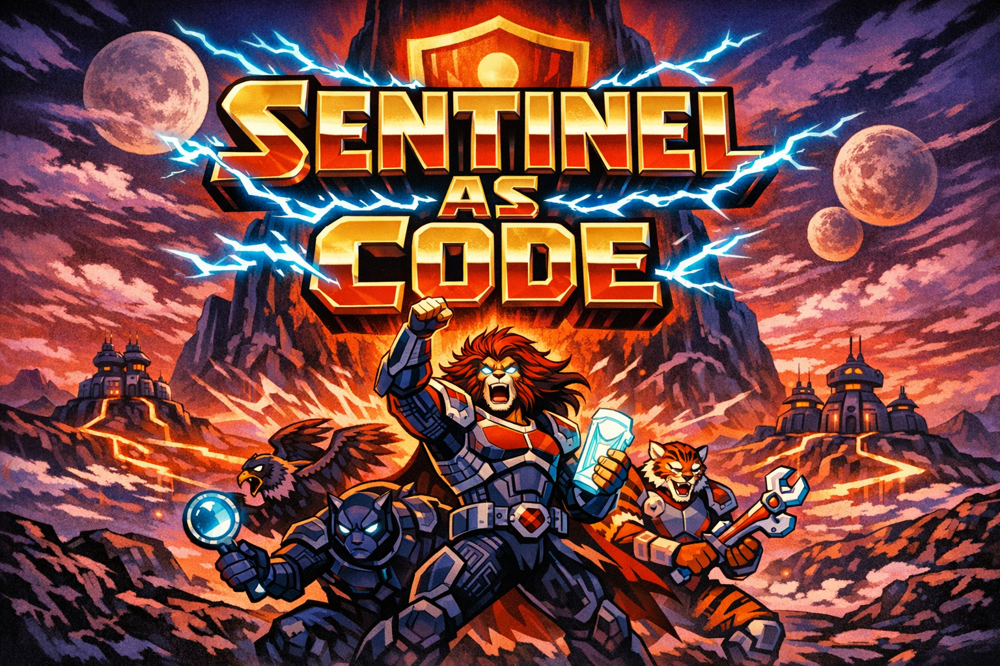

  

# Documentation

Reference material for Sentinel-As-Code, grouped by concern. Pick the
section that matches what you're trying to do.

## Content authoring

Schemas and conventions for every content type the repo deploys.

| Doc | What it covers |
| --- | --- |
| [Analytical Rules](Content/Analytical-Rules.md) | YAML schema for custom analytics rules: required fields, deploy behaviour, Scheduled vs NRT examples |
| [Automation Rules](Content/Automation-Rules.md) | JSON schema for automation rules: trigger conditions, action types (ModifyProperties, RunPlaybook, AddIncidentTask) |
| [Community Rules](Content/Community-Rules.md) | Opt-in third-party rule contributions: deployment defaults, current sources, adding new contributors |
| [Defender Custom Detections](Content/Defender-Custom-Detections.md) | Defender XDR YAML schema, Graph API, response actions, impacted-asset identifiers |
| [Hunting Queries](Content/Hunting-Queries.md) | YAML schema for hunting queries: required fields, tactics/techniques tags, export guide |
| [Playbooks](Content/Playbooks.md) | ARM template requirements, MSI vs standard connections, auto-injected parameters |
| [Summary Rules](Content/Summary-Rules.md) | Summary-rule JSON schema, allowed bin sizes, KQL restrictions, system columns |
| [Watchlists](Content/Watchlists.md) | Watchlist metadata schema, CSV format, KQL usage examples |
| [Workbooks](Content/Workbooks.md) | Gallery-template JSON format, stable GUIDs, export from the Sentinel portal |

## Deployment

How content reaches Sentinel — infrastructure, pipelines, scripts.

| Doc | What it covers |
| --- | --- |
| [Bicep](Deployment/Bicep.md) | Subscription-scoped templates, parameters, dual onboarding mechanism, diagnostic settings, optional playbook RG |
| [Pipelines](Deployment/Pipelines.md) | Pipeline stages, variable group, parameters, service connection, usage examples |
| [Scripts](Deployment/Scripts.md) | PowerShell scripts that drive the pipelines — parameters, examples, known limitations |

## Operations

Continuous run-time concerns: detection drift, DCR inventory, scheduled jobs.

| Doc | What it covers |
| --- | --- |
| [DCR Watchlist Sync](Operations/DCR-Watchlist.md) | Auto-populated DCR inventory watchlist, billing reporting, runbook deployment |
| [Sentinel Drift Detection](Operations/Sentinel-Drift-Detection.md) | Daily detection of portal-edited rules with auto-PR back into the repo |

## Development

Testing, contributing, and extending the tooling.

| Doc | What it covers |
| --- | --- |
| [Pester Tests](Development/Pester-Tests.md) | Running and extending the Pester suite, the AST-extraction pattern this repo uses |

## Auto-generated artefacts

The `Community/` folder (created on first import run) is reserved for files written by
[`Scripts/Import-CommunityRules.ps1`](../Scripts/Import-CommunityRules.ps1).
One file per contributor is regenerated each import run, with per-category
rule listings and last-sync metadata. Do not hand-edit these.

| Auto-generated file | Contributor source |
| --- | --- |
| `Community/Dalonso.md` | David Alonso — see [Community Rules](Content/Community-Rules.md#david-alonso--threat-hunting-rules) |

## Conventions

- **Filename style**: `Title-Case-With-Hyphens.md`
- **Cross-links inside Docs/**: relative paths (`../Operations/Foo.md`, `Sibling.md`). The repo enforces these via the link checker described in [Pester Tests](Development/Pester-Tests.md).
- **Cross-links to repo content**: from a doc at `Docs/{Bucket}/X.md`, the repo root is `../../`. Example: `../../Scripts/Deploy-CustomContent.ps1`.
- **Adding a new doc**: place it in the bucket that matches its concern. If the concern doesn't fit any bucket, propose a new bucket folder rather than dropping the file at the `Docs/` root.
