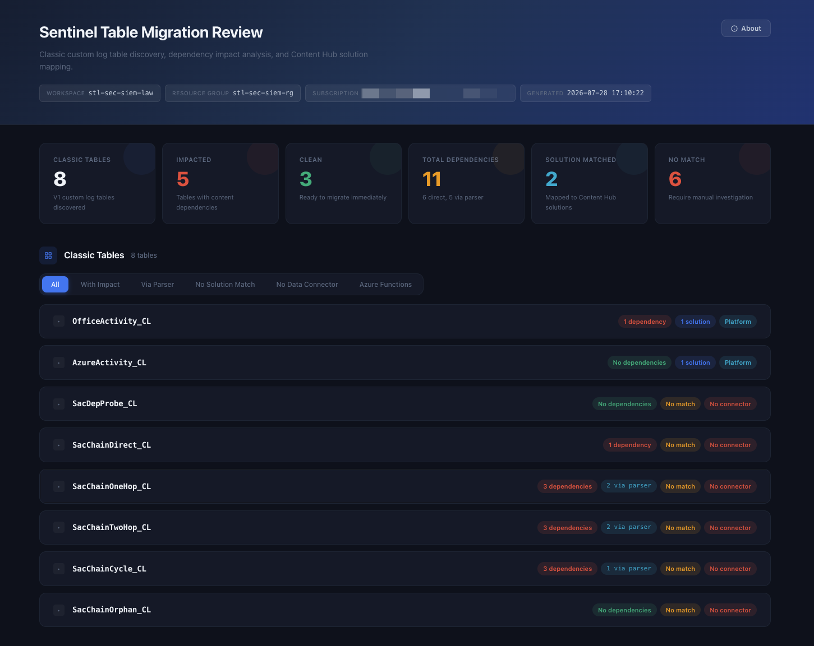

# Table Migration Review

[`Tools/ClassicToDcr/Invoke-TableMigrationReview.ps1`](../../../Tools/ClassicToDcr/Invoke-TableMigrationReview.ps1)
is the assess stage of the [Classic to DCR toolkit](Classic-to-DCR-Toolkit.md). It inventories
the classic V1 custom log tables in a Sentinel workspace and, for each one, scores what breaks
if you migrate it, so the migration is a decision rather than a surprise.

It is **read-only**. It issues `GET` calls to ARM and writes files to a local output folder.
Nothing in the workspace is changed, so it is safe to run against production at any time.

The version documented here is **0.2.0**, the release that added indirect (parser-chain)
dependency resolution.

| What | Where |
| --- | --- |
| Script | [`Tools/ClassicToDcr/Invoke-TableMigrationReview.ps1`](../../../Tools/ClassicToDcr/Invoke-TableMigrationReview.ps1) |
| HTML report template | [`Tools/ClassicToDcr/Templates/report.html.template`](../../../Tools/ClassicToDcr/Templates/report.html.template) |
| Bundled solution mapping | [`Tools/ClassicToDcr/data/solution-mapping.json`](../../../Tools/ClassicToDcr/data/solution-mapping.json) |
| Mapping refresh script | [`Tools/ClassicToDcr/data/update-solution-mapping.mjs`](../../../Tools/ClassicToDcr/data/update-solution-mapping.mjs) |
| Unit tests | `Tests/Test-InvokeTableMigrationReview.Tests.ps1` |
| On-the-box quick reference | [`Tools/ClassicToDcr/README.md`](../../../Tools/ClassicToDcr/README.md) |

The README stays because the kit is designed to be copied standalone to a jump box, where this
page will not be present. This page is the fuller reference.

## The three steps

The console output labels three steps.

1. **Discover.** One `GET` against the workspace `tables` collection returns every table. The
   classic candidates are those whose `schema.tableType` is `CustomLog` **and** whose
   `schema.tableSubType` is `Classic`. `AzureDiagnostics` is excluded by name: it can present as
   `CustomLog`/`Classic` when Custom Fields exist against it, but it is a Microsoft-managed table
   and must never be a migration candidate.
2. **Assess.** Every classic table is scored across seven content types, first by direct name
   match and then by walking outward along parser function aliases.
3. **Map.** Each table is matched to a Content Hub solution using the bundled static mapping plus
   the workspace's own `contentProductPackages`, and the solution's data connector is classified.

The same `tables` call returns two more things that step 2 depends on: every table name in the
workspace, and every column name across every table. Both feed the guards described under
[Guards, and the reason for each](#guards-and-the-reason-for-each). Collecting them costs nothing,
because the call had already fetched and discarded them.

## API versions in use

Pinned as `$script:` constants at the top of the script. Grep for the literal string when one
needs bumping.

| Surface | Version | `$script:` constant | Used for |
| --- | --- | --- | --- |
| `Microsoft.OperationalInsights/workspaces/tables` | `2023-09-01` | `ApiTables` | Table inventory: type, subtype, plan, retention, columns |
| `Microsoft.SecurityInsights/*` | `2024-03-01` | `ApiSentinel` | `alertRules` and `contentProductPackages` |
| `Microsoft.OperationalInsights/workspaces/savedSearches` | `2020-08-01` | `ApiSavedLogs` | Saved searches, which are the source of both hunting queries and parsers |
| `Microsoft.Insights/workbooks` | `2023-06-01` | `ApiInsights` | Workbooks, filtered to `category=sentinel` |
| `Microsoft.Insights/dataCollectionRules` | `2022-06-01` | `ApiDcr` | Listing DCRs so their `transformKql` can be scanned |
| `Microsoft.Logic/workflows` | `2019-05-01` | `ApiLogic` | Playbooks |

Two of these differ from the versions the rest of the toolkit uses, and the difference is
deliberate rather than drift:

- The **migrate** tool and `Test-DcrIngestion.ps1` author and read DCRs at `2023-03-11`, because
  that is the minimum version carrying the `endpoints` property. The review tool only lists DCRs
  to read their transforms, so the older `2022-06-01` is sufficient.
- The Documenter pins `Microsoft.SecurityInsights` at `2024-09-01` and workbooks at `2023-06-01`
  (see [Documenter References](../Documenter/Documenter-References.md#api-versions-in-use)). The
  two tools are independently pinned; nothing forces them into step.

Workbook, DCR, playbook and Content Hub loads are each wrapped in their own `try`. A failure on
any one of them prints a warning and continues with an empty collection for that type, so a
missing Reader role on one resource provider degrades the report rather than aborting the run.
`alertRules` and `savedSearches` are not wrapped: without them there is no assessment to make.

## What counts as a dependency

Seven content types are scanned. All seven are reported directly; six of the seven can also be
reported indirectly.

| Type | Source | Direct match against | Followed indirectly? |
| --- | --- | --- | --- |
| Analytics Rules | `alertRules` | `properties.query` | Yes |
| Hunting Queries | `savedSearches` where `properties.category` is `Hunting Queries` | `properties.query` | Yes |
| Parsers | `savedSearches` where `properties.functionAlias` is set | `properties.query` | Yes |
| Saved Searches | `savedSearches` that are neither of the above | `properties.query` | Yes |
| Workbooks | `Microsoft.Insights/workbooks` | every `query` string found by walking the deserialised `serializedData` | Yes |
| Playbooks | `Microsoft.Logic/workflows` | the whole serialised `properties.definition` JSON | Yes, but only over strings that look like KQL |
| Data Collection Rules | `Microsoft.Insights/dataCollectionRules` | each `dataFlows[].transformKql` that is set and is not the literal `source` | **No, by design** |

### Direct matching

`Test-KqlReferencesTable` applies a word-boundary, case-insensitive regular expression:

```text
(?i)(?<![a-zA-Z0-9_])<escaped table name>(?![a-zA-Z0-9_])
```

The lookarounds are what stop `MyApp_CL` matching inside `MyApp_CL_v2`. Case-insensitivity is
deliberate and is discussed under [Case sensitivity is asymmetric](#case-sensitivity-is-asymmetric).

Direct matching is textual and runs against raw query text, comments included. That is tolerable
for a distinctive `_CL` table name and is the behaviour every previous version of the tool had.

## Dependencies that never name the table

A parser in Log Analytics is a saved search whose `properties.functionAlias` is set. Every other
query invokes it by that alias exactly as if it were a table. So an analytics rule reading

```kusto
OfficeActivityParser
| where Operation == "Add member to role."
```

never mentions `OfficeActivity_CL` anywhere. Searching the workspace for the table name finds
the parser and stops there. Migrate the table and the rule breaks just as hard as one that named
the table directly, and a direct-match report says nothing at all.

Since 0.2.0 the assess step walks the alias graph outward from each classic table and reports
those items too. They are marked **via parser** in the HTML report, carry the chain that explains
them (`rule -> parser -> table`), and appear in `impact.csv` with `DependencyKind`, `Via`,
`ViaChain` and `Depth` columns.

### How the walk works

`Get-ParserAliasIndex` makes one pass over the workspace content and produces an inverted index:
for each resolvable alias, the ascending ids of the content nodes that reference it, plus the
node ids that *define* it. `Resolve-IndirectTableImpact` then runs a breadth-first walk per table:

- **Seeding.** The frontier starts from the aliases of the parsers that read the table
  *directly*, so the indirect result can never disagree with the direct result about where the
  chain begins.
- **Expansion.** Each level expands the aliases tainted by the previous one. A parser reached
  through the chain contributes its own alias to the next frontier.
- **Termination.** First visit wins, which terminates alias cycles (`A -> B -> A`) without any
  cycle-specific code. Termination does not depend on the depth limit.
- **Depth limit.** `-MaxParserChainDepth` (default 10, range 1 to 100) bounds the *reported*
  chain length. Hitting it means a genuinely deep chain exists, so `ChainTruncated` is set, the
  console warns, and the HTML says the number may still understate the blast radius. Nothing is
  dropped silently.
- **Determinism.** Alias frontiers are sorted with an ordinal comparer and the emitted lists are
  sorted by `(Depth, Name, ResourceId)`, so the same input always produces the same report
  regardless of ARM enumeration order.

Two exclusions apply while walking:

- A node already reported as a **direct** dependent is never repeated as an indirect one.
- A parser is never an indirect dependent of its own alias, and two parsers that share an alias
  never depend on each other.

### KQL-aware preparation

Splitting raw query text on `[^A-Za-z0-9_]` finds an identifier wherever it appears, including
places KQL never resolves a name. Each of those produced a false indirect dependency, and a false
dependency on a parser multiplies across every genuine user of that parser at the next hop. So
before matching, each query is reduced to the text in which KQL would actually resolve names.

| Removed | Why |
| --- | --- |
| `// line comments` | KQL has no block-comment form, so `//` to end of line is the whole story. A parser named in a `// TODO` is not a dependency. |
| String literals: `'...'`, `"..."`, verbatim `@'...'` and `@"..."`, multi-line triple-backtick, obfuscated `h'...'` / `h"..."` | A name inside a string is data. Escaping is handled per form, so a `//` inside a string does not open a comment and an apostrophe inside a comment does not open a string. A single-line literal is also terminated by an unescaped newline, which bounds the damage from a malformed query to one line. |
| `cluster(...)`, `database(...)`, `workspace(...)`, `app(...)` qualified references | `cluster("x").database("y").MyParser` is a function in another cluster, not this workspace's parser. |
| Member access, `Something.Name` | A workspace function is referenced bare, never dotted. |
| Assignment targets, `Name = ...` | That is a new column or variable being named, not a function being called. `==` and `=~` are comparisons and are kept; `!=`, `<=` and `>=` cannot match because the character before the `=` is not an identifier character. |
| `let`-bound names | A `let` shadows a stored function of the same name for the rest of the query, so those occurrences are locals. Bound names are collected *before* the assignment-target pass erases the binding site. |

One rewrite runs *before* the strippers rather than after: `Expand-KqlQuotedIdentifier` converts
the bracket-quoted forms `['Name']` and `["Name"]` to a bare `Name`, so the reference survives the
string-literal stripper. It is guarded against the far more common dynamic-index expression
(`parse_json(x)["foo"]`, `Properties['bar']`): a bracket preceded by an identifier, `)` or `]` is
an index into a value, not a quoted entity name, and is left alone.

These rules are deliberately conservative. Each one removes text that *cannot* be a function
reference, so a genuine reference is never lost. What they do not do is prove that a surviving
occurrence is in tabular source position. See [Known limits](#known-limits).

### Guards, and the reason for each

`Get-FunctionAliasSafety` decides whether an alias can be resolved by name at all. The checks run
in this order, and the first failure wins.

| Guard | Reason |
| --- | --- |
| Alias is empty | Nothing to match. |
| Not a plain KQL identifier (`^[A-Za-z_][A-Za-z0-9_]*$`) | A word-boundary match is not reliable against a name containing other characters. |
| Shorter than 4 characters | Too generic to match safely. The floor is an internal parameter defaulting to 4, not exposed on the command line. |
| A reserved name | KQL keywords, tabular operators, literals and scalar type names; the scoping functions `cluster`, `database`, `workspace` and `app`; and the standard columns Log Analytics puts on *every* table (`TimeGenerated`, `TenantId`, `SourceSystem`, `Type`, `Computer`, `RawData`, `ManagementGroupName`). An alias called `where` or `TimeGenerated` matches essentially every query in the workspace, so a match carries no information. Compared case-insensitively. |
| Collides with a real **table** name in this workspace | A query naming `Update` or `SecurityEvent` far more likely means the table. Resolving such an alias would make every query against the genuine built-in table an indirect dependent of whatever classic table that parser happens to read. The workspace table list is already in hand from discovery, so the guard costs nothing. Compared case-insensitively, because a near-miss on a table name is ambiguous to a human reader too. |
| Collides with a **column** name in this workspace | A bare identifier in a column position, `SigninLogs \| project Location`, cannot be told apart from a function call without a full KQL parser. This class compounds at every later hop, so it is refused. Removing it removes the whole class for exactly the names that cause it: `Location`, `IPAddress`, `User`, `Status`. Compared case-insensitively. |

The reserved list is deliberately much shorter than it used to be. It previously carried a second
block of "ubiquitous identifiers" (`alert`, `body`, `data`, `name`, `status`, `user`, `workspace`
and around thirty more) that were standing in for two problems now fixed properly: names colliding
with a real table are caught by the table-name guard, and names colliding with Logic App JSON keys
are caught by restricting playbook alias matching to values that look like KQL.

Suppressing an alias is not free, which is why the list shrank. A parser aliased `Alerts` that
reads a classic table used to sever the whole chain below it and report nothing, which is exactly
the silent breakage the feature exists to prevent.

### Case sensitivity is asymmetric

Indirect alias matching is **case sensitive**. Direct table matching is **case insensitive**.
That is a deliberate asymmetry, not an oversight.

| Matcher | Comparison | Reasoning |
| --- | --- | --- |
| `Test-KqlReferencesTable` (direct) | Case **insensitive** | Behaviour inherited from every previous version and pinned by tests. A case variant of a table name is nearly always a human typo aimed at the real table, so reporting it errs safe. |
| `Get-KqlReferenceIdentifierSet` and the whole indirect pass | Case **sensitive** (ordinal) | KQL entity names are case sensitive: you cannot refer to a table called `ThisTable` as `thisTABLE`. So `officeparser` does not resolve to a parser aliased `OfficeParser` and must not be reported as depending on it. Indirect resolution chains off its own matches, where one wrong hit multiplies at every later hop, so it errs precise. |

A practical consequence: two parsers whose aliases differ only in case are two different
functions, and both are followed independently. An earlier `OrdinalIgnoreCase` vocabulary
collapsed such a pair and dropped one of them without a record.

Resource identity stays case insensitive throughout, because ARM resource ids are.

### Playbooks are matched more narrowly indirectly

The direct pass serialises the whole Logic App definition to JSON and matches the table name
against it. That is fine for a distinctive `_CL` name and useless for an alias: a JSON key or a
word in an action name became a dependency.

So the indirect pass looks only at string **values** inside the definition, and only those shaped
like a query: a pipe followed by a KQL tabular operator, or a query opening with `search`, `find`,
`print`, `union`, `range`, `datatable` or `externaldata`. That is the shape of every Run-query
action body.

The trade is stated plainly: a playbook that builds its query by string concatenation, or passes
it in a shape this test does not recognise, is **not** matched indirectly. Direct table matching
over playbooks is unchanged and still reads the whole definition.

### Data Collection Rules are never followed indirectly

An ingestion-time `transformKql` runs in the pipeline before data reaches the workspace and cannot
invoke a workspace function. An alias appearing in one is therefore a false positive by
construction. DCRs are still scanned for direct table references exactly as before.

### Fan-out warnings

An alias referenced by an implausible share of the whole workspace is more likely a name collision
than a genuine hub parser. The resolver says so loudly and **leaves the finding in place**, because
hiding a finding to reduce noise is the wrong trade here.

The warning fires only when both bounds are met:

| Bound | Value | Purpose |
| --- | --- | --- |
| `FanoutMinimumHits` | 20 | Below this an operator can simply read the chain list, so a warning is only noise. |
| `FanoutMinimumScale` | 50 | Floors the denominator, so a handful of items in a small workspace cannot produce a large ratio. |
| `FanoutWarnRatio` | 0.30 | Content items include workbooks, playbooks and saved searches, so even a heavily shared ASIM-style parser rarely reaches a third of everything. |

These three are parameters of `Get-ParserAliasIndex`, not of the script, so they are not tunable
from the command line. The previous test (5 hits and over 25 per cent of nodes) was unreachable at
real scale and fired on legitimate parsers in small workspaces.

Warnings appear on the console, in `report.json` under `parserAliasResolution.warnings`, and in
the Resolver Coverage section of the HTML report.

### Unresolved bridges

Leaving an alias out of the chain walk is not free. A parser that reads a classic table but whose
alias cannot be resolved is a chain that stops dead: everything calling that parser breaks on
migration without appearing anywhere in the results. Reporting nothing would reproduce exactly the
silent breakage this feature exists to prevent.

So every refusal is recorded, with its reason **and the content that named that alias and was
therefore not resolved**, in three places:

| Surface | Where |
| --- | --- |
| Console | A yellow block per table naming the parser, the alias, the reason, and each unresolved dependent by type and name |
| `report.json` | Per table as `UnresolvedBridges`; workspace-wide as `parserAliasResolution.skippedAliases` |
| `report.html` | A callout above the dependency list on the affected table's card, and a **Resolver Coverage** section for the workspace as a whole |

A bridge severed at the seed (a directly-reading parser whose own alias is unresolvable) and one
severed mid-chain are recorded identically, and a mid-chain break carries the `ViaChain` that
reached it. Each alias is recorded once.

An empty `UnresolvedBridges` is the good case.

### Known limits

State these plainly rather than discovering them later.

- **Residual over-reporting on column-position identifiers.** A bare column reference cannot be
  told apart from a function reference without a full KQL parser. An alias that collides with a
  column name in this workspace is refused outright, which removes the common case. But an alias
  colliding with nothing, yet referenced in an exotic position this analyser cannot rule out,
  could still be miscounted as a dependency. Ruling that out needs a real KQL parser, and the
  standalone constraint (the kit must run with only the Az modules present) rules that out.
- **Playbook indirect matching is shape-based.** See
  [Playbooks are matched more narrowly indirectly](#playbooks-are-matched-more-narrowly-indirectly).
- **Chain depth is bounded for reporting.** Chains deeper than `-MaxParserChainDepth` are flagged
  as truncated, not followed. Raise the value and re-run.
- **The connector classification is only as current as the bundled mapping.** See
  [Content Hub and connector classification](#content-hub-and-connector-classification).
- **Content outside the workspace is invisible.** An external application, an Azure Data Explorer
  cluster or a Power BI dataset querying the table is not discoverable from ARM and is not
  reported.

## Outputs

Pipeline objects plus a report bundle written to `-OutputPath`, which defaults to
`./migration-report` relative to the current directory. That folder is git-ignored, because the
report contains workspace-specific table and connector detail. Treat it as private.

| File | Contents |
| --- | --- |
| `tables.csv` | One row per classic table: name, type, subtype, plan, retention, total retention, column count, resource id |
| `impact.csv` | One row per dependency, direct and indirect |
| `solution-matches.csv` | One row per table and matched solution: solution name, installed, present in Content Hub, GitHub URL |
| `report.json` | Everything above plus the resolver's own coverage, as one structured document |
| `report.html` | Self-contained interactive report |

### `impact.csv` columns

The first four columns keep their names **and their positions**, so a positional consumer written
against the pre-0.2.0 shape still works. The chain columns are appended.

| Column | Direct row | Indirect row |
| --- | --- | --- |
| `TableName` | The classic table | The classic table |
| `ContentType` | One of the seven type names | One of the seven type names |
| `Name` | Display name of the dependent | Display name of the dependent |
| `ResourceId` | ARM resource id | ARM resource id |
| `DependencyKind` | `Direct` | `Indirect` |
| `Via` | empty | The first alias in the chain, that is, the parser the dependent actually calls |
| `ViaChain` | empty | The full route, `outer -> inner -> TableName`, joined with an ASCII arrow so any spreadsheet import survives. The table name is appended here (unlike the JSON chain) because a CSV cell is read out of context and needs to name its own destination |
| `Depth` | `0` | Number of parser hops |
| `ChainTruncated` | table-level flag | table-level flag |

Every row carries every column, because `Export-Csv` takes its header from the first object it
sees.

### `report.json` keys

The JSON is **additive**. Every key that existed before still exists and still means the same
thing.

| Key | Meaning |
| --- | --- |
| `generatedAt`, `subscription`, `resourceGroup`, `workspace` | Run context |
| `classicTables[]` | The discovered classic tables |
| `impactAnalysis[]` | One entry per table (see below) |
| `solutionMatches[]` | Content Hub matches plus `ConnectorClassification` |
| `parserAliasResolution` | Workspace-wide resolver coverage: `resolvedAliases`, `skippedAliases`, `warnings` |

Within each `impactAnalysis[]` entry:

| Key | Meaning | New in 0.2.0? |
| --- | --- | --- |
| `TableName` | The classic table | No |
| `TotalImpacted` | **Direct hits only.** Unchanged meaning, so anything written against the old shape reads the same number | No |
| `AnalyticsRules`, `HuntingQueries`, `Parsers`, `SavedSearches`, `Workbooks`, `Playbooks`, `Dcrs` | **Direct hits only.** Each item carries `DependencyKind = 'Direct'` | No |
| `TotalIndirect` | Count of items reaching the table only through a parser | Yes |
| `TotalAffected` | `TotalImpacted + TotalIndirect`, the honest blast radius | Yes |
| `IndirectAnalyticsRules`, `IndirectHuntingQueries`, `IndirectParsers`, `IndirectSavedSearches`, `IndirectWorkbooks`, `IndirectPlaybooks`, `IndirectDcrs` | Chained dependents. Each item carries `DependencyKind = 'Indirect'`, `Via`, `ViaChain` and `Depth` | Yes |
| `ChainTruncated` | True when a chain for this table was deeper than `-MaxParserChainDepth` | Yes |
| `UnresolvedBridges[]` | Parsers this table reaches whose own alias could not be resolved, each with `Alias`, `Parser`, `Reason`, `ReferenceCount`, `Dependents[]` and `ViaChain`. Empty is the good case | Yes |

`IndirectDcrs` always exists and is always empty, because DCRs are not followed indirectly. It is
present so all seven types have a parallel array and a consumer can iterate the type list without
a special case.

### HTML report sections

<p align="center">
  
</p>

The tiles across the top summarise the workspace; the list below is one expandable card per
classic table, badged with its dependency count and how many of those reach it only through a
parser. The filter row narrows the list to the tables worth attention first.


| Section | Contents |
| --- | --- |
| Header and meta bar | Workspace context and generation timestamp. The tool version badge sits in the About modal, not here |
| Stats | Six tiles: classic tables, impacted tables (any dependency, direct or indirect), clean tables, total dependencies (with a direct and via-parser split), solution matched, no match |
| Classic Tables | One expandable card per table, with a filter bar: All, With Impact, Via Parser, No Solution Match, No Data Connector, Azure Functions |
| Resolver Coverage | Workspace-wide: which aliases were not followed and why, each with the content that named them; plus any fan-out warnings. Rendered only when there is something to say |
| Key Concepts | Static explainers: classic tables, DCR-based tables, API retirement, Content Hub, data lake compatibility, schema consistency |

Within each table card, in this order:

1. A callout naming any parser chain that could not be followed for this table. It is first on
   purpose: reading a dependency list without knowing where it stops is worse than reading no
   list at all.
2. A callout summarising how many dependencies reach the table through a parser, and noting
   truncation when it applies.
3. One block per content type that has any dependents. The count beside the heading is the total
   for that type, direct plus indirect, with a `N direct - M via parser` split beneath it, so the
   number beside "Analytics Rules" is the number of analytics rules that break rather than a
   number that lies by omission. Indirect items sit inside their own content type, not in a
   section of their own.
4. Content Hub solutions, with the connector kind per solution.
5. The connector-availability callout, when no modern connector exists.
6. The **Migration Command** section.
7. Table Properties: plan, retention, column count, sub type.

## The migration command the report generates

Each table card carries a Migration Command section with two ready-to-run invocations of
`Invoke-ClassicTableMigration.ps1`, with the resource group, workspace and table name already
filled in, and a copy button on each.

| Command | Tag | What it does |
| --- | --- | --- |
| Preview | Read-only | `... -ListOnly`. Lists the table, its size and its current sub type. Changes nothing. Run it again after migrating to confirm the sub type flipped to `DataCollectionRuleBased`. |
| Migrate and deploy | One-way | `... -Deploy`. Converts the table to DCR-based, then deploys the generated data collection rule. Prompts for confirmation before it commits. |

`-SubscriptionId` is appended only when the captured subscription value really is a GUID.
Anything else would bind successfully and then fail at `Set-AzContext` after the paste.

Run the commands from `Tools/ClassicToDcr` in a signed-in PowerShell 7 session.

Two cases produce an explanatory note instead of a command:

- The report captured no resource group or workspace. The note says so, rather than blaming the
  table name.
- The table name is not one the migrate tool can accept. `Invoke-ClassicTableMigration.ps1` puts
  `[ValidatePattern('^[A-Za-z0-9_]+$')]` on `-TableName` and only migrates names ending in `_CL`,
  so anything else cannot be expressed as a valid command and must be handled by hand.

### Why the report is inert

The HTML report **executes nothing**. It is a static file: no external scripts, stylesheets, fonts
or images, no `fetch`, no `XMLHttpRequest`. The only outbound URLs are documentation and author-profile hyperlinks
you can choose to click. All of this is pinned by tests in
`Tests/Test-InvokeTableMigrationReview.Tests.ps1`.

It also deliberately has **no button that performs a migration**. Migration is irreversible, and
the report is a static file that may well be emailed on to somebody who was not in the room. It
hands you the command; you decide when to run it. The Migration Command section sits after the
connector-availability callout for the same reason: the reader should see whether a replacement
connector exists before they see the command that removes the classic table.

The copy handler reads the command from the rendered `textContent` rather than a `data-*`
attribute, so there is only one escaping context to get right, and it is bound with
`addEventListener` rather than an inline `onclick`. A clipboard fallback via `execCommand` is kept
because the report is normally opened from `file://`, where `navigator.clipboard` is not
guaranteed.

### The PowerShell quoting rule

Values interpolated into the generated command are wrapped in PowerShell single quotes, inside
which PowerShell performs no variable interpolation, no subexpression evaluation and no backtick
escapes. The closing quote is therefore the only character with meaning.

PowerShell closes a single-quoted string on **five** characters, not one:

| Code point | Character |
| --- | --- |
| `U+0027` | ASCII apostrophe |
| `U+2018` | left single quotation mark |
| `U+2019` | right single quotation mark |
| `U+201A` | single low-9 quotation mark |
| `U+201B` | single high-reversed-9 quotation mark |

All five are interchangeable as both delimiter and escape, and doubling any of them yields that
literal character. Escaping only `U+0027` would let a resource group named with a curved quote
close the string early and append further statements to the copied command, and Azure resource
group names do permit Unicode. The generator therefore doubles all five, which is the complete
encoding.

## Parameters

| Parameter | Type | Required | Default | Purpose |
| --- | --- | --- | --- | --- |
| `-SubscriptionId` | string | Prompted if omitted | - | Subscription containing the workspace. Switches the Az context when it differs from the current one |
| `-ResourceGroupName` | string | Prompted if omitted | - | Resource group of the Log Analytics workspace |
| `-WorkspaceName` | string | Prompted if omitted | - | Log Analytics workspace name |
| `-OutputPath` | string | No | `./migration-report` | Directory for the CSV, JSON and HTML output. Created if absent |
| `-NonInteractive` | switch | No | `$false` | Skip all prompts. Throws when a required parameter is missing, which is what you want in a pipeline |
| `-MaxParserChainDepth` | int (1 to 100) | No | `10` | Parser hops to follow. Ten is more than double the deepest hierarchy Microsoft ships. A deeper chain is reported as truncated, never dropped silently |

## Content Hub and connector classification

Step 3 matches each classic table to a Content Hub solution using the bundled
`data/solution-mapping.json` (a case-insensitive lookup, falling back to the table name with the
`_CL` suffix stripped), then cross-references the workspace's own `contentProductPackages` to
report whether the solution is present in Content Hub and whether it is installed.

The solution's first `DataConnector` dependency is classified heuristically from its content id:

| Kind | Identified by | Meaning |
| --- | --- | --- |
| `CCF` | id ending `CCP`, `CCF`, `Definition`, `_Ccp_`, `_Ccf_`, or containing `CCPDefinition` | Codeless Connector Framework. The modern replacement path |
| `AzureFunctions` | `Serverless`, `AzureFunction`, `Polling`, `PollingAuth`, trailing `Func`, `_API_FunctionApp` | Deploys an Azure Function app. These are the ones that need rebuilding, not just repointing |
| `AMA` | id ending `Ama` | Azure Monitor Agent, which already uses DCRs |
| `Platform` | id starting `Azure`, `Office`, `Microsoft`, `Defender`, `ThreatIntelligence`, `WindowsEvent`, `SecurityEvents` | Microsoft first-party |
| `Agent` | id is exactly `CEF` or `Syslog` | Agent-based collection. Note `CefAma` classifies as `AMA`, because the AMA check runs first |
| `Legacy` | anything else | No modern classification could be derived |
| `Unknown` | no connector id found on the package | The solution declares no `DataConnector` dependency |

Tables with **no** Content Hub match are listed on the console and filterable in the HTML, with
the suggestion to raise a feature request through your Microsoft CSAM or SSP. That is genuinely
the remedy: if no modern connector exists, no amount of local work produces one.

This classification is a heuristic over naming conventions observed in the upstream Solutions
Analyzer data, not an authoritative statement from the service, and it is only as current as the
bundled mapping file. The weekly workflow keeps the mapping fresh; if the file is missing, the
script warns and continues with no solution matches rather than failing.

## Running it

```bash
# Interactive. Prompts for subscription, resource group and workspace.
./Invoke-TableMigrationReview.ps1
```

```bash
# Scripted. Writes the report bundle to a dated folder.
./Invoke-TableMigrationReview.ps1 \
    -SubscriptionId '00000000-0000-0000-0000-000000000000' \
    -ResourceGroupName 'rg-sentinel' \
    -WorkspaceName 'ws-sentinel' \
    -OutputPath './migration-report/2026-07'
```

```bash
# Pipeline. No prompts, and a deeper chain walk for a workspace with layered parsers.
./Invoke-TableMigrationReview.ps1 \
    -SubscriptionId '00000000-0000-0000-0000-000000000000' \
    -ResourceGroupName 'rg-sentinel' \
    -WorkspaceName 'ws-sentinel' \
    -NonInteractive \
    -MaxParserChainDepth 20
```

The run returns a pipeline object carrying `Context`, `ClassicTables`, `Impacts`,
`SolutionMatches` and `OutputPath`, so it can be consumed directly as well as through the files.
A workspace with no classic tables returns early and writes nothing.

## Troubleshooting

| Symptom | Cause and fix |
| --- | --- |
| `Workbook load failed`, `DCR load failed`, `Logic App load failed` | A missing read role on that resource provider, at subscription scope. The run continues with that content type empty, which means dependencies of that type are not reported. Grant Reader and re-run rather than accepting the gap |
| `Content Hub query failed` | Missing Microsoft Sentinel Reader on the workspace. Step 3 continues with no packages, so solutions show as not present in Content Hub |
| `Solution mapping file not found` | `data/solution-mapping.json` did not travel with the script. Copy the `data/` folder alongside it, or accept that step 3 reports no matches |
| `HTML template missing` | `Templates/report.html.template` did not travel with the script. CSV and JSON are still written |
| N parser aliases are not resolved (console warning) | Expected and informative, not an error. Read the reason for each. An alias colliding with a real table or column is a correct refusal; a chain that stops there still needs checking by hand |
| Dependency chains deeper than N hops | Re-run with a higher `-MaxParserChainDepth` |
| A table you expected shows zero dependents | Check it is genuinely unused before concluding that. Content outside the workspace is invisible to this tool, and an unresolved bridge on that table means the list is known to be incomplete |
| Report shows a table you must not migrate | `tableSubType` reads `Classic` for any table with Custom Fields. Only `_CL` tables are genuine candidates; `AzureDiagnostics` is already excluded by name |

## Related

- [Classic to DCR Migration Toolkit](Classic-to-DCR-Toolkit.md) - overview, prerequisites, RBAC,
  the retirement timeline
- [Rehearsal Aids](Rehearsal-Aids.md) - how to prove this tool detects what it claims to, using
  [`New-DependencyFixture.ps1`](../../../Tools/ClassicToDcr/Rehearsal/New-DependencyFixture.ps1)
- [Deploy Scripts, `Invoke-ClassicTableMigration.ps1`](../../Deploy/Scripts.md#invoke-classictablemigrationps1) -
  the tool the generated command invokes
- [Parsers](../../Content/Parsers.md) - how this repository authors and deploys the
  `savedSearches` functions that create the indirect case
- [Documenter References](../Documenter/Documenter-References.md#api-versions-in-use) - the
  Documenter's independently pinned api-versions, for comparison
- [Custom logs migration](https://learn.microsoft.com/azure/azure-monitor/logs/custom-logs-migrate)
- [Log Analytics functions](https://learn.microsoft.com/azure/azure-monitor/logs/functions)
- [Azure-Sentinel Solutions Analyzer](https://github.com/Azure/Azure-Sentinel/tree/master/Tools/Solutions%20Analyzer)
